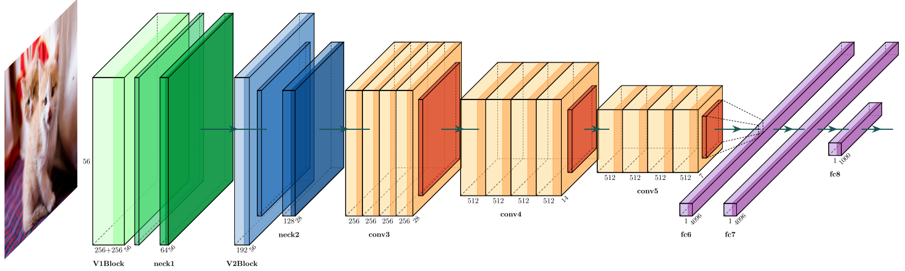

# SVP-Neural-Network

**Semi-bionic Visual Pathway Neural Network (SVPNN)**: A framework that simulates V1 and V2 at the front of neural networks

## Introduction

> SVPNN simulates the first half of human ventral visual pathway, by mimicking V1 and V2 area with fixed-weight Linear-Nonlinear models. Here's the overview of ventral pathway and SVPNN architecture.

------

## Quick Start

> NOTE: No Pretrained Model Available Now! Train before Validation please. 

### Requirements:

> Dependencies:

    tqdm
    scipy
    pandas
    requests
    torch >= 1.6.0
    torchvision
    imagecorruptions

> Type the following command to install dependencies:

    $ pip install -r requirements.txt

### Train a model

> The main script we use here is [`run.py`](./run.py). For example if you want to train SVPNN with DenseNet-121 back-end:

    $ python run.py --in_path /path/to/dataset/ImageNet --output_path /path/to/store/results --mode train --mode_arch densenet121

> If you want to train DenseNet-121 without SVPNN framework, add `-n` or `--no_svp` at the tail of the above command.

    $ python run.py --in_path /path/to/dataset/ImageNet --output_path /path/to/store/results --mode train --mode_arch densenet121 -n

### Validation

> Validation is a little bit, but the restore epoch number and model weight path is required (there two parameters will also be used when you want to restore the training process), for example:

    $ python run.py -i /path/to/dataset/ImageNet -o ./results/densenet121 -repoch 30 -rpath ./results/densenet121 -m val -a densenet121

> Robustness Evaluation is also provided, similar to validation but change `--mode` or `-m` to `rval`:

    $ python run.py -i /path/to/dataset/ImageNet -o ./results/densenet121 -repoch 30 -rpath ./results/densenet121 -m val -a densenet121

### Experiment Parameters setting:

> Here we provide the parameters to adjust the environment settings for both training and validating. Here we show a context where 4 GPUs are used, epoch number 70, batch size 256, 10 dataloading workers and restore checkpoint from epoch 50 in path `./results/densenet121`.

    $ python run.py -i /path/to/dataset/ImageNet -o ./results/densenet121 -repoch 50 -rpath ./results/densenet121 -m train -g 4 -j 10 -e 70 -b 256 -n -a densenet121 -c speckle_noise -s 2

